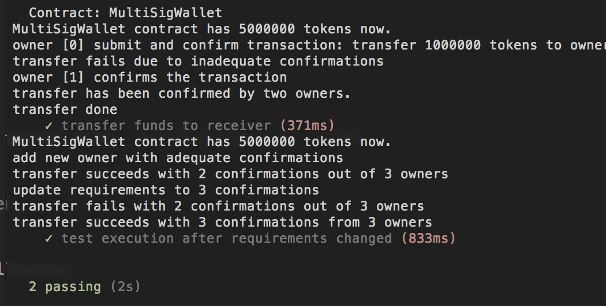

## Multi-Signature Wallet with ERC20 Token Support

### 1. Specifications:

1. The account that deployes the contract is the `token contract owner`;
2. `Multisig Wallet Contract` has all the tokens at the begining;
3. Multisig Wallet can have up to 50 owners;
4. Multisig Wallet contract needs to set owner addresses and requiredConfirmation when deployed;
3. Transfer funds between accounts needs adequate confirmations from wallet owners;
4. Token contract owner can freeze any account to prevent tranferring funds out from these accounts;
5. Token owner can unfreeze or whitelist accounts to enable transfer;
6. Token owner can return a list of all accounts that received tokens;

### 2. Install depencies

Currently support node.js v8.11.1

```
$ npm intall 
```

### 3. JS testing

```
$ truffle test
```

The result is similar to following:




### 4. Deploy to Ropsten TestNet

deploy the contracts to ropsten network as:

```bash
$ truffle migrate <account1,account2,...,accountN> <requiredConfirmations> --network ropsten
```

For example:

```bash
$ truffle migrate 0x57db0db20dd46b83fa2acbf800c145b6df1b9052,0x6e3373b09901fc55497cd2583b164da366771d7e 2 --network ropsten
```

### 5. Use Case:

```Javascript
// generate encoded bytes of transfer transaction
const transferEncoded = tokenInstance.contract.transfer.getData(accounts[1], 1000000*scale)

// submit transaction
let transferReceipt = await multisigInstance.submitTransaction(tokenInstance.address, 0, transferEncoded, {from: accounts[0]})
// get transaction Id
let transactionId = transferReceipt.logs[0].args.transactionId.toNumber()

// should fail to execute transfer due to inadequate confirmations
await multisigInstance.executeTransaction(transactionId, {from: accounts[0]})
assert.equal(false, await multisigInstance.isExecuted(transactionId, {from: accounts[0]}))


// second owner confirm the tx
await multisigInstance.confirmTransaction(transactionId, {from: accounts[1]})

// confirm the tx is confimed
assert.equal(true, await multisigInstance.isConfirmed(transactionId, {from: accounts[1]}))
        
// transfer transaction should be successful
await multisigInstance.executeTransaction(transactionId, {from: accounts[1]})
assert.equal(true, await multisigInstance.isExecuted(transactionId, {from: accounts[1]}))
```


